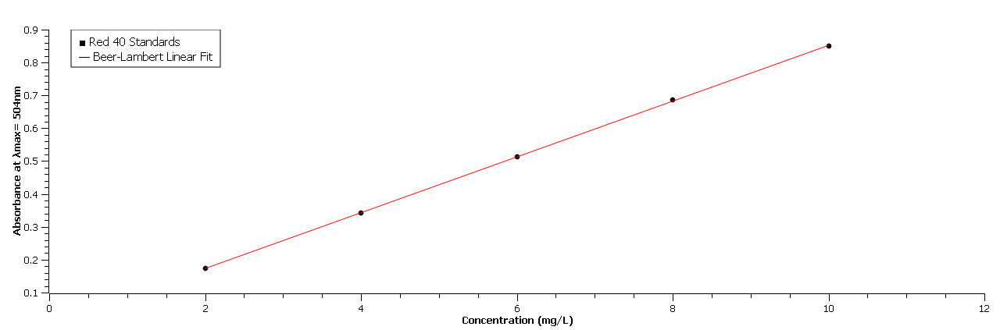
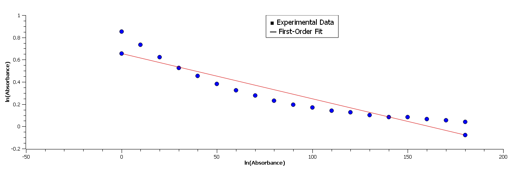

# Spectrophotometric Quantification and Kinetic Modeling of Food Dyes

An analytical chemistry portfolio project focusing on the quantitative determination of Allura Red (Red 40) in commercial beverages using UV-Vis Spectroscopy, followed by pseudo-first-order kinetic modeling of oxidative bleaching using SciDAVis.

## 🧪 Project Overview
* **Objective:** Quantify dye concentrations using the Beer-Lambert Law and determine the reaction rate constant ($k$) of dye degradation.
* **Software Tool:** SciDAVis (Open-source data analysis and graphing environment)

## 📊 Methodology & Analytical Pipeline
1. **Calibration:** Prepared 5 serial dilutions of Red 40 (2–10 mg/L). Measured absorbance at $\lambda_{max} = 504\text{ nm}$.
2. **Linear Regression:** Plotted Absorbance vs. Concentration in SciDAVis to determine the molar absorptivity factor via linear fit.
3. **Kinetics:** Monitored absorbance decay at 10-second intervals upon adding sodium hypochlorite (bleach). Applied integrated rate laws to confirm reaction order.

## 📈 Calculated Lab Results
### Calibration Curve

### Kinetics Decay Curve

* **Calibration Curve Equation:** $\text{Absorbance} = 0.0850 \times \text{Concentration} + 0.0031$
* **Linear Correlation ($R^2$):** $0.9996$ (Proves high measurement precision)
* **Calculated Unknown Beverage Concentration:** $4.92\text{ mg/L}$
* **Reaction Order:** Confirmed Pseudo-First-Order via linear fit of $\ln(\text{Absorbance})$ vs. Time.
* **Calculated Bleaching Rate Constant ($k$):** $0.0165\text{ s}^{-1}$

## 📁 Repository Contents
* `calibration_standards.csv` - Raw calibration standards data.
* `kinetics_run.csv` - Raw time vs. absorbance kinetics tracking data.
* `dye_analysis.sciprj` - Complete SciDAVis workspace file containing all active formulas, structured data tables, and dynamic mathematical curve fits.
* `calibration_plot.png` - Publication-ready calibration curve.
* `kinetics_plot.png` - Polished pseudo-first-order decay curve.

## 🛠️ How to Reproduce this Analysis
1. Download and install [SciDAVis](https://scidavis.org).
2. Clone or download this repository.
3. Open `dye_analysis.sciprj` inside SciDAVis to inspect the tables, active automated column formulas (`ln(col("Absorbance"))`), and live regression analysis curves.
Update README with analytical chemistry project details
